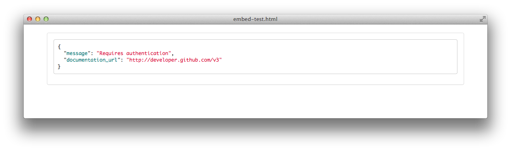
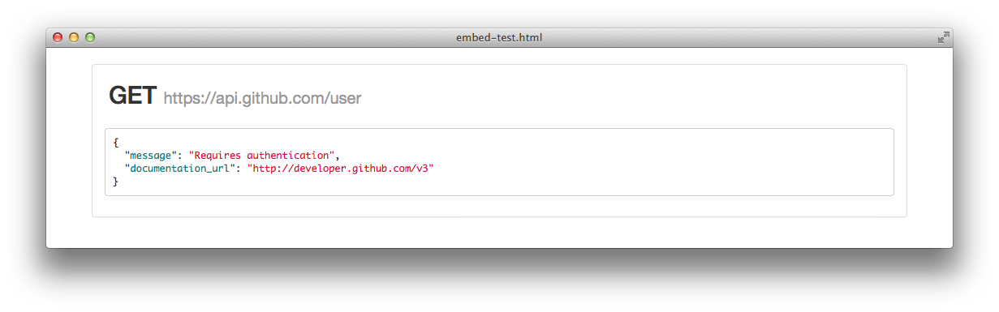
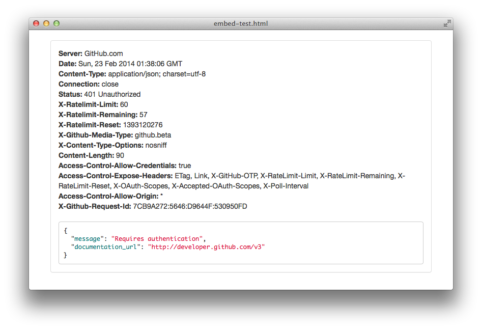
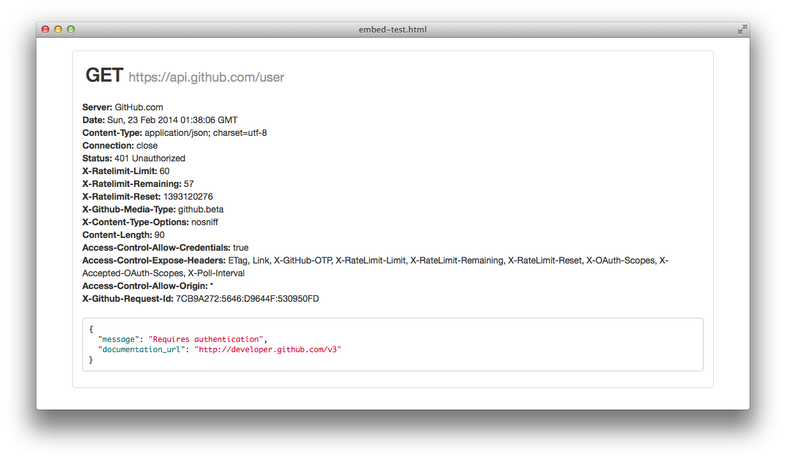
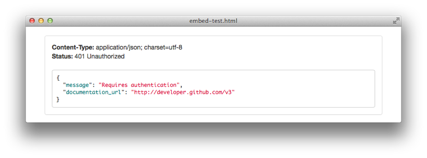

# ReHTTP

ReHTTP is a project to help developers debug, collaborate and share HTTP
requests. This tool is designed to take all the features missing from existing
tools and bring them into a single open source application.

### Alternatives

- [RequestBin](http://requestb.in/)
- [hurl.it](http://hurl.it)
- [Blueprint](http://apiblueprint.org/)

### Minimum requirements

- Ruby 2.1.0
- PostgreSQL

### Setup

```bash
$ script/bootstrap
```

This will check everything is where it should be and that you have all the
required dependencies available.

### Running the application

ReHTTP is running on unicorn and follows the
[unix process model](https://devcenter.heroku.com/articles/process-model) and
resources are controlled via a Procfile. This allows gives the ability of
determining what process types get what resources within the application and
also allows for quick scalability should it be needed.

To start the web server, run `script/server`.

### Embedding requests

ReHTTP gives you the ability to embed a particular request into any page. This
becomes quite handy for documentation or example use guides as it has the
request and response available for inspection. In addition to the base
embedding of the body you can choose what parts (navigation, URL and headers) of
the request you would would like to show. Below are some screenshots and the
embed code to achieve them.

**Just body response** `<script src="https://rehttp.me/r/a93d2a2a.js"></script>`.



**Body with URL** `<script src="https://rehttp.me/r/a93d2a2a.js?show_url=true"></script>`



**Body with navigation** `<script src="https://rehttp.me/r/a93d2a2a.js?show_navigation=true"></script>`


**Body with HTTP headers** `<script src="https://rehttp.me/r/a93d2a2a.js?show_headers=all"></script>`



In addition to the examples above, you can also mix and match the embed request
params to suit your needs.

**URL with navigation** `<script src="https://rehttp.me/r/a93d2a2a.js?show_navigaton=true&show_url=true"></script>`


**URL with HTTP headers** `<script src="https://rehttp.me/r/a93d2a2a.js?show_url=true&show_headers=all"></script>`



### Displaying HTTP headers

When embedding requests you don't always need to show all HTTP request headers
and instead you may only wish to show a selection of the headers that relate to
the request at hand. ReHTTP allows you to do this by passing through the header
name in the `show_headers` query parameter.

For example, if you only want to show the "status" and "content-type" HTTP
headers you would use the following snippet.

`<script src="https://rehttp.me/r/a93d2a2a.js?show_headers=status,content-type"></script>`

Which would give you the following output:



### Running tests

The testing tool of choice is [RSpec](http://rspec.info/) and the test suite can
be run using `script/test`.
